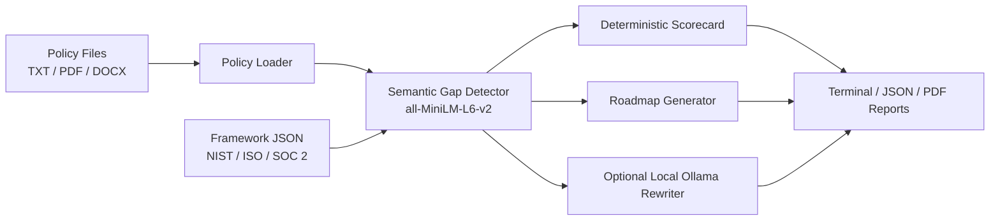

# POLARIS

[](https://www.python.org/)
[](LICENSE)
[](https://github.com/your-org/polaris/actions/workflows/ci.yml)
[](#testing)

POLARIS is an offline cybersecurity policy gap analysis engine for security teams, auditors, and portfolio reviewers. It compares policy documents against structured frameworks such as NIST CSF, ISO 27001, and SOC 2 using local semantic embeddings, then produces deterministic scores, remediation roadmaps, terminal dashboards, JSON exports, and PDF reports.

## Demo

```text
$ python main.py --policy data/sample_policies/isms_policy.txt --framework nist_csf --format terminal

POLARIS Analysis: Isms Policy
Framework: NIST_CSF
Maturity: 58.33% - Defined

Gap Analysis
┏━━━━━━━━━━┳━━━━━━━━━━┳━━━━━━━┳━━━━━━━━━━━━━━━━━━━━━━━━━━━━━━┓
┃ Control  ┃ Function ┃ Score ┃ Missing Clauses              ┃
┡━━━━━━━━━━╇━━━━━━━━━━╇━━━━━━━╇━━━━━━━━━━━━━━━━━━━━━━━━━━━━━━┩
│ GV.OC-01 │ GOVERN   │     2 │ external dependencies        │
│ PR.AA-01 │ PROTECT  │     3 │ None                         │
│ RS.MA-01 │ RESPOND  │     1 │ escalation matrix, forensics │
└──────────┴──────────┴───────┴──────────────────────────────┘
```

## Architecture



## Quick Start

```bash
pip install -r requirements.txt
python main.py --policy data/sample_policies/isms_policy.txt --framework nist_csf --format terminal
python main.py --policy "data/sample_policies/*.txt" --framework nist_csf --format pdf
```

The first sentence-transformer run may need the `all-MiniLM-L6-v2` model available locally. After that, analysis remains fully offline.

## CLI Reference

| Flag | Required | Default | Description |
| --- | --- | --- | --- |
| `--policy` | Yes, unless `--all` | None | Policy path or glob pattern. Can be repeated. |
| `--framework` | No | `nist_csf` | Framework key or JSON file path. |
| `--output` | No | timestamped file in `outputs/` | Output file path for JSON/PDF. |
| `--format` | No | `terminal` | One of `terminal`, `json`, or `pdf`. |
| `--threshold` | No | `0.45` | Semantic similarity threshold for clause coverage. |
| `--all` | No | false | Run all bundled sample policies. |
| `--verbose` | No | false | Show additional details and policy improvement text. |

Running `python main.py` with no arguments prints help and exits cleanly.

## Framework Support

| Framework | Status | File |
| --- | --- | --- |
| NIST CSF 2.0 | ✅ | `data/frameworks/nist_cis_controls.json` |
| ISO 27001:2022 Annex A | ✅ | `data/frameworks/iso27001_controls.json` |
| SOC 2 Trust Services Criteria | ✅ | `data/frameworks/soc2_controls.json` |

## Output Formats

- Rich terminal dashboards for analyst workflows.
- JSON reports for integration with other tools.
- PDF reports with cover page, executive summary, gap analysis, roadmap, coverage matrix, and local LLM-enhanced improvement text.

## Offline Design

POLARIS does not call external APIs during analysis. Gap detection uses local sentence-transformer embeddings. Ollama/Mistral is optional and only used to draft policy improvement language; scoring and control coverage remain deterministic.

## Testing

```bash
pytest --cov=engine --cov=output --cov-report=term-missing
```

The test suite covers semantic detection, policy ingestion, scorecard logic, and report generation.

## Contributing

See [CONTRIBUTING.md](CONTRIBUTING.md) for development setup, framework schema details, and testing expectations.

## Roadmap

- Web UI for interactive policy review.
- GDPR, HIPAA, and PCI DSS framework packs.
- API mode for local automation.
- Evidence mapping and control-owner workflows.
